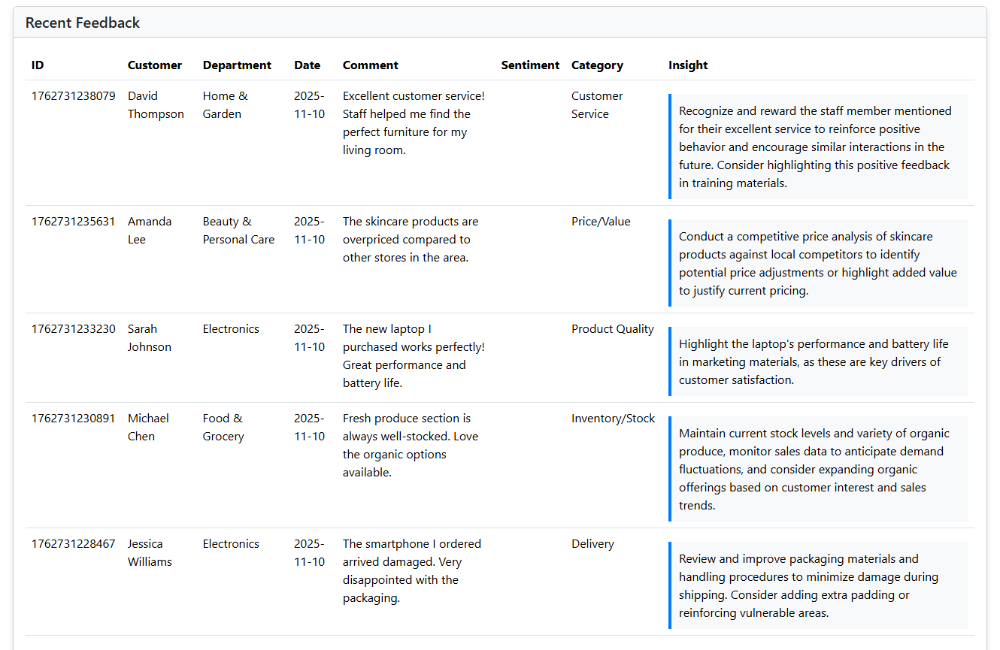

# AI-Enhanced Customer Feedback Platform

A modern Spring Boot application that processes customer feedback with automated sentiment analysis and AI-powered insights using Google's Gemini AI.

## 🎯 Project Overview

This application demonstrates a complete feedback processing pipeline that:
- Accepts customer feedback through REST API or web forms
- Performs automated sentiment analysis using Stanford CoreNLP
- Enhances feedback with AI-generated categories and actionable insights via Google Gemini
- Provides a dashboard for viewing and analyzing feedback trends
- Supports both synchronous and asynchronous processing

## ✨ Key Features

- **Automated Sentiment Analysis**: Stanford CoreNLP integration for accurate sentiment detection
- **AI-Powered Insights**: Google Gemini AI categorizes feedback and generates actionable recommendations
- **Async Processing**: Non-blocking batch processing for handling multiple feedback entries
- **REST API**: Comprehensive RESTful endpoints for all operations
- **Web Dashboard**: Interactive UI for viewing feedback and analytics
- **Monitoring**: Spring Boot Actuator with health checks and metrics

## 🛠️ Technology Stack

- **Backend**: Java 24, Spring Boot 3.4.1
- **Build Tool**: Gradle 8.10.2
- **AI/ML**: Google Gemini AI, Stanford CoreNLP 4.5.10
- **Architecture**: RESTful API, Async Processing, Repository Pattern
- **Code Quality**: Lombok 1.18.38, MapStruct 1.6.3
- **HTTP Client**: OkHttp 4.12.0

## 📋 Prerequisites

- Java 24 or higher
- Gradle 8.10.2 or higher (wrapper included)
- Google Gemini API Key ([Get one here](https://aistudio.google.com/app/apikey))

## 🚀 Quick Start

### 1. Clone the Repository

```bash
git clone https://github.com/shubhamPatelDev/ai-feedback-service.git
cd ai-feedback-service/feedback-service
```

### 2. Configure API Key

Set your Gemini API key as an environment variable:

**Windows (PowerShell):**
```powershell
$env:GEMINI_API_KEY="your-actual-api-key-here"
```

**Windows (CMD):**
```cmd
set GEMINI_API_KEY=your-actual-api-key-here
```

**Linux/Mac:**
```bash
export GEMINI_API_KEY=your-actual-api-key-here
```

The application reads the API key from the `GEMINI_API_KEY` environment variable configured in `application.yml`.

### 3. Build and Run

**Windows:**
```cmd
gradlew.bat clean build
gradlew.bat bootRun
```

**Linux/Mac:**
```bash
./gradlew clean build
./gradlew bootRun
```

The application will start at `http://localhost:8080`

## 📸 Screenshots

### Feedback Submission Form


### Feedback Dashboard with Reviews


## 📡 API Endpoints

### Feedback Operations

| Method | Endpoint | Description |
|--------|----------|-------------|
| GET | `/` | Web form for submitting feedback |
| GET | `/feedback/view` | View all feedback entries |
| POST | `/feedback/submit` | Submit feedback via web form |
| GET | `/api/v1/feedback` | Get all enhanced feedback (JSON) |
| GET | `/api/v1/feedback/summary` | Get feedback statistics |
| POST | `/api/v1/feedback/raw/api` | Process single feedback via API |
| POST | `/api/v1/feedback/batch` | Process multiple feedbacks (async) |
| POST | `/api/v1/sentiment/analyze` | Analyze sentiment only |

## 🏗️ Project Structure

```
feedback-service/
├── src/main/java/com/retailstore/feedback/
│   ├── controller/      # REST controllers
│   ├── service/         # Business logic
│   ├── repository/      # Data access layer
│   ├── model/           # Domain models and DTOs
│   ├── mapper/          # MapStruct mappers
│   ├── config/          # Configuration classes
│   └── exception/       # Exception handlers
├── src/main/resources/
│   ├── templates/       # Thymeleaf templates (submit.html, success.html)
│   ├── application.yml  # Application configuration
│   └── logback-spring.xml  # Logging configuration
└── build.gradle.kts     # Build configuration
```

## 🔧 Configuration

### Environment Variables

| Variable | Description | Default |
|----------|-------------|---------|
| `GEMINI_API_KEY` | Google Gemini API key | Required |
| `SPRING_PROFILES_ACTIVE` | Active profile (dev/prod) | `dev` |
| `SERVER_PORT` | Server port | `8080` |
| `FEEDBACK_FILE_PATH` | Feedback data file path | `file:sentiment_feedback_output.txt` |

### Application Profiles

- **dev**: Development mode with detailed logging
- **prod**: Production mode with optimized logging

## 📊 Monitoring

Access Spring Boot Actuator endpoints:

```bash
# Health check
curl http://localhost:8080/actuator/health

# Metrics
curl http://localhost:8080/actuator/metrics

# Application info
curl http://localhost:8080/actuator/info
```

## 📝 License

This project is licensed under the MIT License - see the [LICENSE](LICENSE) file for details.

## 🤝 Acknowledgments

- Google Gemini AI for AI-powered insights
- Stanford CoreNLP for sentiment analysis
- Spring Boot framework

## 📧 Contact

For questions or feedback, please open an issue on GitHub.
